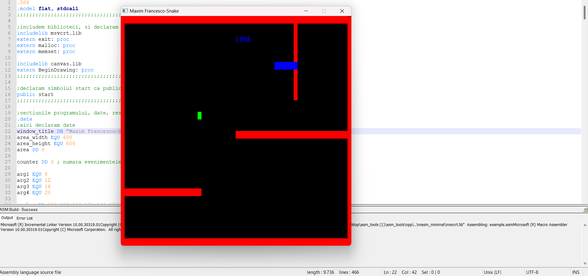

# 🐍 Snake Game in Assembly (x86)

A graphical **Snake game** developed in **x86 Assembly**, using low-level memory manipulation and the `canvas.lib` graphics library. Built for educational purposes as part of the **Computer Architecture / Assembly Programming** curriculum.

## 🎮 Gameplay Overview

- Classic Snake logic with movement via `W`, `A`, `S`, `D`
- Apple (target) randomly spawns on screen
- Snake grows upon eating an apple
- Static obstacle collision detection
- Losing condition upon wall/obstacle collision
- Keyboard control:
  - `W` / `A` / `S` / `D` → Movement
  - `R` → Restart the game
  - `Q` → Quit the game

## 🧠 Key Concepts Practiced

- Low-level memory management with `malloc`, `memset`
- Timer-based rendering (snake updates every 200ms)
- Handling keyboard input at interrupt level
- Manual vector shifting for snake body movement
- Collision detection against boundaries and obstacles
- ASCII-based text rendering with pixel drawing

## 🧱 Architecture

- Assembly structured with `.data` and `.code` sections
- Modular `make_text` procedure for drawing characters
- Snake position stored as two separate coordinate arrays (`snakex[]`, `snakey[]`)
- Apple generation via `rdtsc` pseudo-random method
- Walls drawn with loops using `make_text_macro`

## ⚙️ Requirements

- Windows OS
- MASM (Microsoft Macro Assembler)
- `canvas.lib` graphics library
- `digits.inc` and `letters.inc` (used for drawing characters)

## 🚀 How to Run

1. Make sure you have `MASM32` or equivalent setup installed
2. Include `canvas.lib`, `digits.inc`, and `letters.inc` in the same directory
3. Compile using:
   ```
   ml /c /coff example.asm
   link /subsystem:console example.obj canvas.lib msvcrt.lib
   ```
4. Run the resulting `.exe` file

## 🖼️ Preview

> 

## 📌 Controls

| Key | Action            |
|-----|-------------------|
| `W` | Move Up           |
| `A` | Move Left         |
| `S` | Move Down         |
| `D` | Move Right        |
| `R` | Reset Game        |
| `Q` | Quit Game         |

## 👨‍💻 Author

**Maxim Francesco**  
Third-year CS student at UTCN passionate about low-level programming, systems design, and operating systems.
